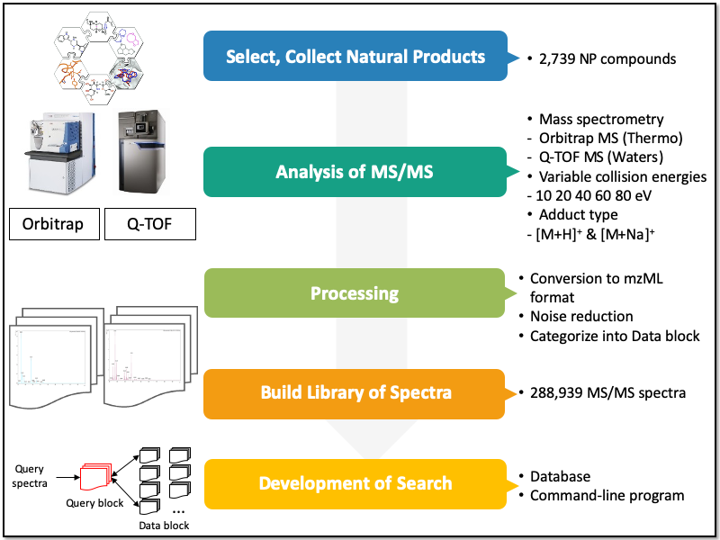

# bmdms-np
BMDMS-NP is a database that encompasses ESI MS/MS mass spectra of natural compounds, especially plant secondary metabolites. At present, the database contains 288,939 MS/MS spectra of 2,739 natural compounds that are commercially available.

## Dependencies
1. Anaconda for python 3.7

2. JRE 8.0

3. Numpy
		
		conda install -c anaconda numpy
4. SQLAlchemy

		conda install -c anaoncda sqlalchemy	
5. Pymysql

		conda install -c anaconda pymysql
6. Scikit Learn

		conda install scikit-learn
7. Pymzml

		conda install -c bioconda pymzml
8. RDKit

		conda install -c rdkit rdkit
9. Jpype1
		
		conda install -c conda-forge jpype1
10. PyFingerprint

		pip install git+git://github.com/hcji/PyFingerprint@master

11. Matplotlib-venn (optional)

		conda install -c conda-forge matplotlib-venn

12. Clone the code

		git glone https://github.com/chalbori/bmdms-np.git
  
## Usage
Take sample/search_block.py as examples for running as described in the file name.

To check molecular structures of compounds included in database, SDFiles in the folder out/sdfs/ are being provided.
